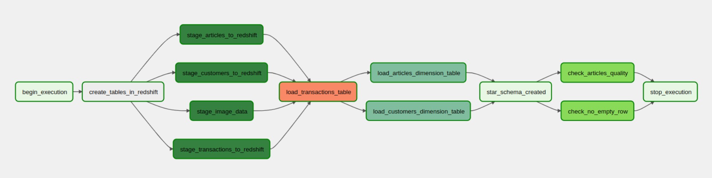
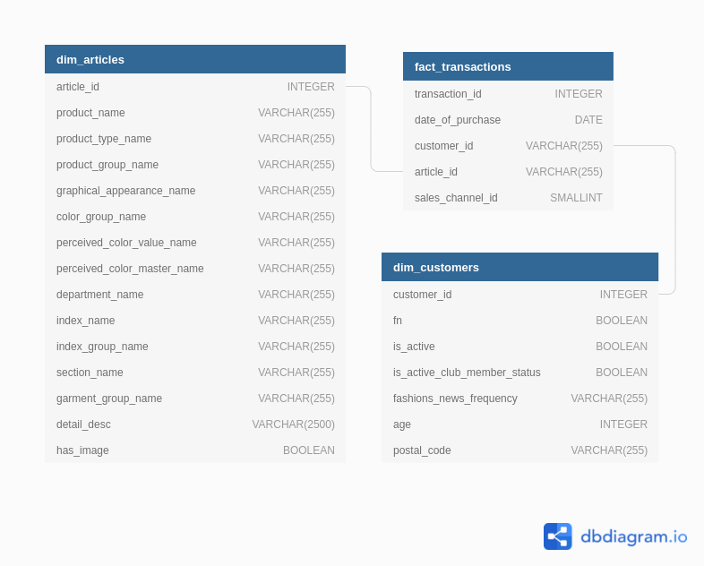

# Data Engineering Capstone Project

## Introduction

In this project, a data warehouse for H&M analytical team are created with an ETL pipeline.
The database is designed as a star schema with transactions of purchase of fashion articles from H&M.

Following question could be answered:
- Which products group are most popular in year 2020?
- What is the distribution of user that buy the TShirt and also has active club member?
---

## Project Description

In this project, an ETL pipeline to provide the analytics team with a data model that can be used to recommend products to customers.



Pipeline:
1. Gather data from kaggle
    For this project, manual download and upload into S3 will be used. In day to day operation, a streaming data pipeline, or directly accessing the data from the source DB, should be used. A pipeline that ingest the data source are recommended.
2. Save the csv data into staging area in redshift.
3. Save the partitioned image data (the images are already partitioned with the first three digist of article id)in S3.
4. Creating a star schema from the staging area in Redshift

Technology used:
- S3 : for saving source dataset
- Redshift : for staging and serves as datawarehouse
- Airflow : orchestration tool for ETL pipeline

In the future a spark cluster could be used for processing the data. Because the data we obtained are already cleaned, so we don't need to do any further processing and cleaning.

---

## Project Structure

```
.
├── assets : contains static assets
├── dags
│   ├── sql
│   │   └── create_tables.sql : sql to create redshift schema
│   └── recommendatation_dwh_dag.py : main airflow dag file
├── dataset : dsample dataset
├── docker-compose.yaml : docker compose file to run airflow
├── infra : contains infrastructure files
├── plugins
│   ├── helpers
│   │   ├── __init__.py
│   │   └── sql_queries.py : sql queries to create tables
│   ├── __init__.py
│   └── operators
│       ├── articles_quality.py : operator for quality check of article table
│       ├── __init__.py
│       ├── load_dimension.py : operator to  load dimension table
│       ├── load_fact.py : operator to load fact table
│       ├── no_empty_row.py : operator to quality check if fact and dimension table does not have empty row
│       ├── stage_image_data.py : operator for stage the list of image into redshift
│       └── stage_redshift.py : operator to stage data into redshift
│       └── unique_column.py : operator to check if the column is unique
├── README.md : project readme
├── requirements.txt : project requirements
└── sync_secrets.py : script to sync secrets from AWS Secrets Manager to .env file
```

---

## Project Datasets


The dataset was obtained from [kagle competition](https://www.kaggle.com/c/h-and-m-personalized-fashion-recommendations/data) dataset. The dataset are already cleaned. Gathering the data are done with the `kagle cli` with following command:

`kaggle competitions download -c h-and-m-personalized-fashion-recommendations`


The dataset contains the purchase history of the customers. Following files are included in the dataset:

- images/ - a folder of images corresponding to each article_id; images are partitioned with the first three digits of articles id.
- articles.csv - detailed metadata for each article_id available for purchase
- customers.csv - metadata for each customer_id in dataset
- transactions_train.csv - the purchases history each customer for each date.

---

## Data Catalog



The data model will be a star schema with `transactions` as the **FACT** table, and `customers` and `articles` as the **DIMENSION** tables. The `articles`table will have another metatable that improves the information of the `articles` table.

The `transactions` are used as **FACT** table, because it contains the most of the transaction data (movement data/events). The colom `id` or `code` or `no` are dropped, since they are not useful for our analysis. But the `articles` will have another column `has_image` that indicates whether the article has an image or not.

---

**Star Schema**
Star schema are chosen, because the query from the business analyst (requirement) are mostly related on the transactions of the customer. With the star schema, the query will be more efficient. The 
disadvantages will be that the data integrity is not guaranteed, but this could be checked with the data quality check.

Snowflake Schema is also a consideration, but the business analyst prefer faster approach to create a faster reporting and act based on it (such as send promotion email to the customer).


### Fact Table
**Transactions**


| Column Name      | Type            | Example                                                          |
|------------------|-----------------|------------------------------------------------------------------|
| transaction_id   | VARCHAR(255)    | a12d5b43e67d225668fa                                             |
| date_of_purchase | DATE            | 2018-09-20                                                       |
| customer_id      | VARCHAR(255)    | 00007d2de826758b65a93dd24ce629ed66842531df6699338c5570910a014cc2 |
| article_id       | INTEGER         | 85687003                                                         |
| price            | DECIMAL(19, 18) | 0.016932203389830508                                             |
| sales_channel_id | SMALLINT        | 2                                                                |

### Dimension Table
**Customers**

| Column Name                  | Type         | Example                                                          |
|------------------------------|--------------|------------------------------------------------------------------|
| customer_id                  | VARCHAR(255) | 00000dbacae5abe5e23885899a1fa44253a17956c6d1c3d25f88aa139fdfc657 |
| fn                           | BOOLEAN      | true                                                             |
| is_active                    | BOOLEAN      | false                                                            |
| is_active_club_member_status | BOOLEAN      | true                                                             |
| fashions_news_frequency      | VARCHAR(255) | Regularly                                                        |
| age                          | INTEGER      | 24                                                               |
| postal_code                  | VARCHAR(255) | 8ff2d3103bd127d46e7238c6cee0f3fd9a01bd4a49fb98883df888090eff2927 |


**Articles**

| Column Name                 | Type         | Example                                 |
|-----------------------------|--------------|-----------------------------------------|
| article_id                  | INTEGER      | 108775051                               |
| product_name                | VARCHAR(255) | 108775                                  |
| product_type_name           | VARCHAR(255) | Strap top (1)                           |
| product_group_name          | VARCHAR(255) | Vest top                                |
| graphical_appearance_name   | VARCHAR(255) | Solid                                   |
| color_group_name            | VARCHAR(255) | Light Beige                             |
| perceived_color_value_name  | VARCHAR(255) | Dusty Light                             |
| perceived_color_master_name | VARCHAR(255) | White                                   |
| department_name             | VARCHAR(255) | Jersey Basic                            |
| index_name                  | VARCHAR(255) | Ladieswear                              |
| index_group_name            | VARCHAR(255) | Ladieswear                              |
| section_name                | VARCHAR(255) | Womens Everyday Basics                  |
| garment_group_name          | VARCHAR(255) | Jersey Basic                            |
| detail_desc                 | VARCHAR(255) | Jersey top with narrow shoulder straps. |
| has_image                   | BOOLEAN      | true                                    |


--- 
## Data quality

Following data quality checks are performed:
- check if there are data in the articles, customers and transactions
- check if all datas in staging_articles are transformed into articles
- check if all datas in customers and transactions are unique.

---

## Query Example

Following question could be answered:
- Which products group are most popular in year 2020?
  ```sql
  SELECT product_type_name,
         COUNT(*)
  FROM fact_transactions ft
         JOIN dim_articles da ON ft.article_id = da.article_id
  WHERE DATE_PART_YEAR(date_of_purchase) = 2020
  GROUP BY product_type_name
  ORDER BY COUNT(*) DESC;
  ```
- What is the distribution of user that buy the TShirt and also has active club member?
  ```sql
  SELECT is_active_club_member_status,
         COUNT(*)
  FROM fact_transactions ft
         JOIN dim_articles da ON ft.article_id = da.article_id
      JOIN dim_customers dc ON ft.customer_id = dc.customer_id
  WHERE product_type_name = 'T-shirt'
  GROUP BY is_active_club_member_status
  ```

---

## Data Update Frequency
For answering the given query, the data could be updated daily. To generate the report the analyst does not need the actual data.
For time crucial data, such as customer winback (if a customer want to delete their account), then a realtime data will be great, so the customer could get a realtime offer before deleting their account.
A real time data could be achieved by using pyspark streaming that read the stream and ingest the data into the staging area. Another “cron” task could be scheduled to ingest the data into the fact and dimension tables by appending into it.

---


## Possible Scenario

- **The data was increased by 100x.**
  => With the solution in this ETL pipeline, this should give no problem at all. The heavy task are given 
  to the cloud (Redshift) and the calculation are based on sql, which run also on cloud. 
  The airflow is just used as an orchestration tool for maintaining the data movement.
- **The data populates a dashboard that must be updated on a daily basis by 7am every day.**
  => Because of the time constraint, the data could be triggered early in the morning and this should be 
  also not a problem at all. An SLA could be set for the data to be updated before 7am. 
  If the SLA could not be achieved, then the redshift cluster could be scaled up to accommodate the data.
- **The database needed to be accessed by 100+ people.** 
  => This will be no problem at all, since we are using the native internal table from Redshift. 
  The query performance will be much better than the external table (reading from S3).

---

## Infrastructure

For this project, I'll be using Amazon Web Services (AWS) to store data and run ETL pipelines. You'll be using the following services:
- S3 are used because its capability to save big data and images (images in this project is around 35 GB)
- Redshift are used to stage the s3 into the staging area, because its fast and easy to access and a native service from AWS
- Airflow is used to run the ETL pipeline
- Terraform to build the infrastructure, it is easy to clean up redshift cluster after using in development.

### Prerequisites:
To generate the infrastructure, I'll be using the [Terraform](https://www.terraform.io/) tool.

1. Make sure that aws profile in `~/.aws/credentials` is set to `udacity`.
2. [Terraform cloud](https://cloud.hashicorp.com/products/terraform) are used to save the remote state. 
   Local teraform state could be used as well. Just replace the cloud attribute with `local` in `infra/main.tf` file. 

### Creating the infrastructure
```bash
cd infra/
terraform init
terrafrom apply
```

---

## Installing Airflow

Installing `airflow 2.2.4` and its packages to **ease the development** locally.
```bash
export AIRFLOW_VERSION=2.2.4
export PYTHON_VERSION="$(python --version | cut -d " " -f 2 | cut -d "." -f 1-2)"
export CONSTRAINT_URL="https://raw.githubusercontent.com/apache/airflow/constraints-${AIRFLOW_VERSION}/constraints-${PYTHON_VERSION}.txt"
pip install "apache-airflow[postgres,amazon]==${AIRFLOW_VERSION}" --constraint "${CONSTRAINT_URL}"
```

## Run Airflow
1. Fillout `.env` file with all necessary environment variable. It could be done in 2 ways:
   1. By creating infrastructure yourself and sync secrets to your local machine.
      - Make sure `~/.aws/credentials` is set to `udacity`, otherwise change the variable `AWS_PROFILE` in `sync_secret.py`
      - Run sync_secret.py to sync the AWS secrets to the `.env` file. (It will generate automatically)
   2. By filling out manually with following template in `.env`file:
    ```bash
    AIRFLOW_CONN_REDSHIFT_CONN_ID=<<FILL ME>>
    AIRFLOW_VAR_REDSHIFT_IAM_ARN=<FILL ME>
    ```

2. Run airflow with `docker-compose up` command.
    ```bash
    docker-compose up -d
    ```


- Login to Airflow UI: http://localhost:8080
  - User: airflow
  - Password: airflow